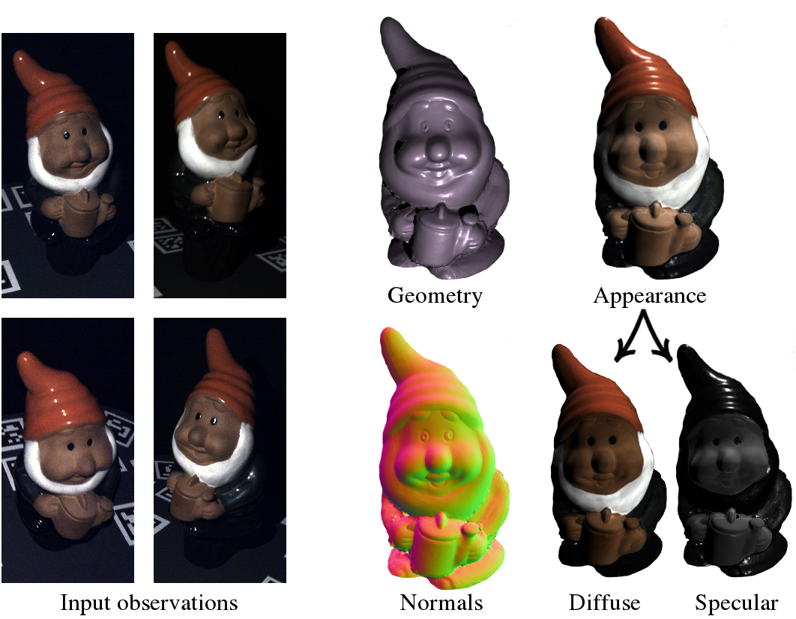

# On Joint Estimation of Pose, Geometry and svBRDF from a Handheld Scanner

#### [Project Page](https://avg.is.tuebingen.mpg.de/publications/schmitt2020cvpr) | [Paper](http://www.cvlibs.net/publications/Schmitt2020CVPR.pdf) | [Spotlight Video](https://www.youtube.com/watch?v=_xxSQPD9qU0) | [Presentation](http://www.cvlibs.net/publications/Schmitt2020CVPR_slides.pdf) | [Poster](http://www.cvlibs.net/publications/Schmitt2020CVPR_poster.pdf)

This is the source code repository for our CVPR publication [On Joint Estimation of Pose, Geometry and svBRDF from a Handheld Scanner](http://www.cvlibs.net/publications/Schmitt2020CVPR.pdf).

By Carolin Schmitt, Simon Donné, Gernot Riegler, Vladlen Koltun and Andreas Geiger.

If you find our code or paper useful, please consider citing

    @inproceedings{Schmitt2020CVPR,
      title = {On Joint Estimation of Pose, Geometry and svBRDF from a Handheld Scanner},
      author = {Schmitt, Carolin and Donne, Simon and Riegler, Gernot and Koltun, Vladlen and Geiger, Andreas},
      booktitle = { Proceedings IEEE Conf. on Computer Vision and Pattern Recognition (CVPR)},
      year = {2020}
    }

## Installation

We provide the installEnv.sh script for provisioning the dependencies of this repository.
A working version of both conda (<https://conda.io/>) and CUDA is required.

By default, the script uses Pytorch 1.4 compiled with CUDA 10.0, but this can easily be changed in 'installEnv.sh'.
In line 69 change the 'cudatoolkit=10.0' to the CUDA version of your system. This can be checked with:

    which nvcc

## Sensor data

You will be able to download sensor data both for either invidivual objects and for the entire dataset from the paper.
At the moment, only one object is available, but we work on uploading the rest soon.
Download the pre-processed captures via

    mkdir data
    cd data/
    wget https://s3.eu-central-1.amazonaws.com/avg-projects/handheld_svbrdf_geometry/data_single.zip
    unzip data_single.zip

## Run the method

After downloading and extracting the data locally, you need to adapt the 'path_localization' dictionary in 'code/general_settings.py'.
- input_data_base_folder: The path of the 'captures' folder.
- output_base_folder: Where to save the output files.
- calibration_base_folder: The path of the 'calibration' folder.
- gt_scan_folder: The path of the 'gt_scans' folder.

At the end of 'main.py' you can specify for which object and which center_view you want to run the optimization and evaluation.

Make sure that the conda environment is activated and you are in the correct folder:

    conda activate handheld_svbrdf_geometry
    cd code/

Then run

    python main.py

When evaluating on a headless server, specify egl as the platform for pyrender:

    PYOPENGL_PLATFORM=egl python main.py

### Evaluation

The code in this repository produces slightly different results than the ones reported in the paper, as it was refactored for release.
Since this occurs consistently over all baselines, we expect the evaluation code is responsible for these changes.
We are working on resolving it, but we note that the results still support all our findings in the publication.

